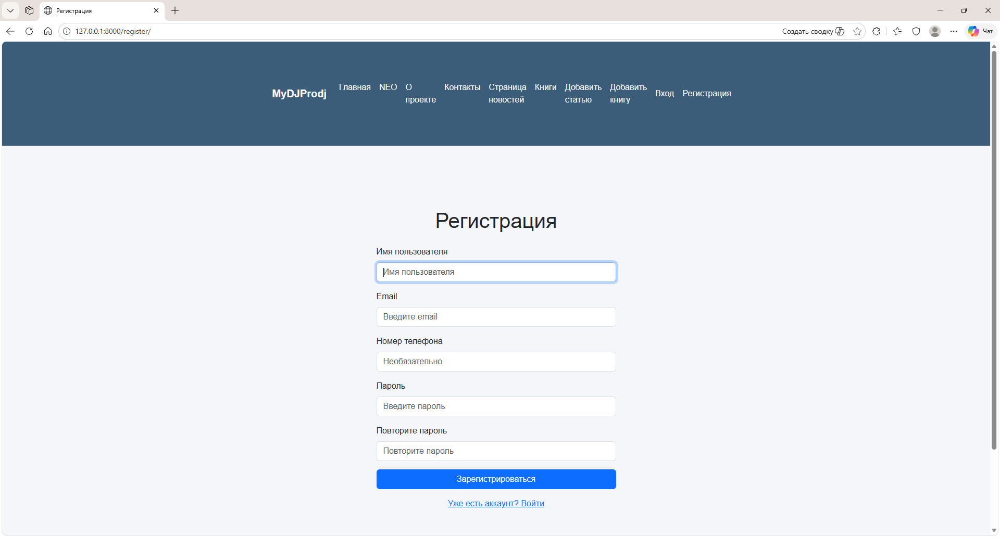

# 🇬🇧 English README Version

---

# MyDJProdj — Django Learning Project


An educational Django project featuring news, books, articles, image uploads, custom user registration, an extended admin panel, a weather module, and full integration with a Telegram bot via a secure REST API.

---

## 📸 Screenshots
| Home | News | Books | Neo |
|------|------|-------|-----|
|  |  |  |  |

### Custom registration & Adin panel
| Custom Registration                            | Custom Admin (Backup DB) |
|------------------------------------------------|--------------------------|
|  |  |
---

## 🚀 Features

### Main pages
- `/` — Home
- `/about/` — About
- `/books/` —  List of books
- `/contacts/` — Contacts
- `/news/` — List of news
- `/neo/` — Code viewer (Prism.js + dark theme)
- `/register/` — Custom registration
- `/weather/` — Weather page (OpenWeatherMap API)

### Admin panel
- Fully custom BackupAdminSite
- One‑click database backup
- Statistics block on the admin homepage
- Overridden Django admin templates
- Search, filters, sorting
- Slug display
- Collapsible service fields

### News
- `/news/` — All news
- `/news/<id>/` — News detail
- Bootstrap cards
- “Read more”
- Auto‑assigned author

### Books
- `/books/` — list of books
- `/books/<id>/` — detailed book page
- Covers, description, reviews
- Cards with a "Learn more" button

### Users 

- Custom user registration
- Custom form and validation
- Extended authentication flow

### 🌤 Weather Page

The Weather module provides:

- weather search by city name
- temperature, humidity, wind speed, dew point
- Bootstrap‑based UI
- error handling for invalid cities
- integration with the Telegram bot

---

## 🤖 Telegram Bot Integration

The project includes full two‑way integration between Django and a Telegram bot.

### 🔗 REST API for the Bot

The bot communicates with Django via a secure API:

- POST /api/v1/register/ — register a Telegram user
- GET /api/v1/user/<telegram_id>/ — get user profile

All requests require a security header: 

```
X-BOT-SECRET: <secret key>

```

### 👤 TelegramUser Model

Stores:

Telegram ID

- username, first name, last name
- language code
- registration date
- last activity
- subscription status
- geolocation (latitude, longitude)

### 🤖 Bot Features

- /start — registration + profile output
- /myinfo — fetch profile from Django
- /weather — weather in Pskov
- /weather <city> — weather by city name
- automatic weather notifications (morning & evening)
- inline buttons:
    - Weather in Pskov
    - Choose city
    - Help
    - Stop notifications

### 🛡 Security

- API access is protected with a secret key (X-BOT-SECRET)
- The serializer exposes only safe, controlled fields
- The Django admin panel provides full control over Telegram users
- All bot–server communication uses JSON over HTTPS (recommended for production)
- No anonymous access to bot endpoints

## 📡 API Reference

### POST /api/v1/register/

Registers a Telegram user.

#### Request example

```
{
  "telegram_id": 123456,
  "username": "vivaldy",
  "first_name": "Vladimir",
  "last_name": "Trofimov",
  "language_code": "en",
  "latitude": null,
  "longitude": null
}
```
#### Response example

```
{
  "status": "ok",
  "created": true,
  "user": {
    "telegram_id": 123456,
    "username": "vivaldy",
    "first_name": "Vladimir",
    "last_name": "Trofimov",
    "language_code": "en",
    "registered_at": "...",
    "last_activity": "...",
    "is_subscribed": true
  }
}
```
---

## GET /api/v1/user/<telegram_id>/

Returns a Telegram user profile.

### Response example

```
{
  "status": "ok",
  "user": {
    "telegram_id": 123456,
    "username": "vivaldy",
    "first_name": "Vladimir",
    "last_name": "Trofimov",
    "language_code": "en",
    "registered_at": "...",
    "last_activity": "...",
    "is_subscribed": true
  }
}
```
---

## 📂 Project structure

The full project structure is available in a separate file:

➡️ [ARCHITECTURE.md](../ARCHITECTURE.md)

---

### ▶️ Running the project

## 1. Using the script

```
run_django.bat
```
The script automatically:

- navigates to the project directory
- activates the virtual environment
- starts the development server

## 2. Manual run

```
cd MyDJProdj
venv\Scripts\activate
python manage.py runserver
```

---

### ⏹ Stopping the server

```
stop_django.bat
```
The script:

- finds Django processes
- terminates them
- prints status
- works in UTF‑8
---

The run_all.bat and stop_all.bat scripts are displayed on the neo page.

---

### 🛠 Technologies

Python 3.11
Django 5.2
Bootstrap 5
Prism.js
HTML + CSS

---

### 📌 Roadmap

- Pagination
- News categories
- Images for news
- Contact form
- Improved admin UI

---

### 📄 License                                

MIT License
Educational use only.

---


