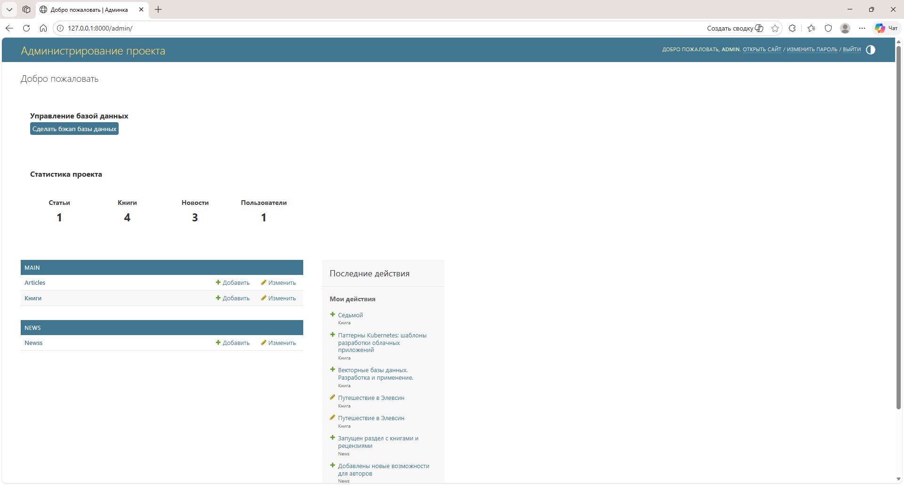
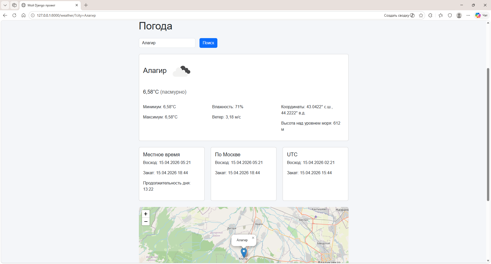
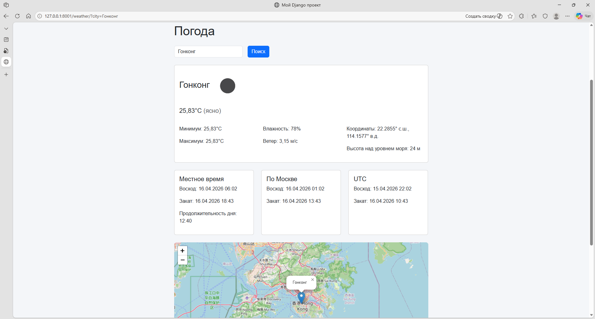

# 🇬🇧 English README Version

---

# MyDJProdj — Django Learning Project


An educational Django project featuring news, books, articles, image uploads, custom user registration, an extended admin panel, a weather module, and full integration with a Telegram bot via a secure REST API.

---

## 📸 Screenshots
| Home | News | Books | Neo |
|------|------|-------|-----|
|  |  |  |  |

### Custom Registration & Admin Panel
| Custom Registration                  | Custom Admin (Backup DB) |
|--------------------------------------|--------------------------|
|  |  |

## 🌤 Weather Page (Screenshots)
| Weather (City Input)                    | Weather (Result)              |
|-------------------------------------|----------------------------------------|
|  |  |

---

## 🚀 Features

### Main pages
- `/` — Home
- `/about/` — About
- `/books/` —  List of books
- `/contacts/` — Contacts
- `/news/` — List of news
- `/neo/` — Code viewer (Prism.js + dark theme)
- `/register/` — Custom registration
- `/weather/` — Weather page (OpenWeatherMap API)

### Admin panel
- Fully custom BackupAdminSite
- One‑click database backup
- Statistics block on the admin homepage
- Overridden Django admin templates
- Search, filters, sorting
- Slug display
- Collapsible service fields

### News
- `/news/` — All news
- `/news/<id>/` — News detail
- Bootstrap cards
- “Read more”
- Automatically assigned author

### Books
- `/books/` — List of books
- `/books/<id>/` — detailed book page
- Covers, description, reviews
- Cards with a "Learn more" button

### Users 

- Custom registration
- Custom form and validation
- Extended authentication flow

#### 🌤 Weather Page

The Weather module provides:

- Weather search by city name
- City map
- Display of temperature, humidity, and wind speed
- Sunrise and sunset times (local, Moscow, and UTC)
- Daylight duration
- City elevation above sea level
- Bootstrap cards
- API error handling
- Integration with a Telegram bot

---

## 🤖 Telegram Bot Integration

The project includes full two‑way integration between Django and a Telegram bot.

### 🔗 REST API for the Bot

The bot communicates with Django via a secure API:

- POST /api/v1/register/ — register a Telegram user
- GET /api/v1/user/<telegram_id>/ — get user profile

All requests require a security header: 

```
X-BOT-SECRET: <secret key>

```

### 👤 TelegramUser Model

Stores:

- Telegram ID
- username, first name, last name
- language code
- registration date
- last activity
- subscription status
- geolocation (latitude, longitude)

### 🤖 Bot Features

- /start — registration + profile output
- /myinfo — fetch profile from Django
- /weather — weather in Pskov
- /weather <city> — weather by city name
- Automatic weather notifications (morning and evening)
- Inline buttons:
    - Weather in Pskov
    - Choose city
    - Help
    - Stop notifications

### 🛡 Security

- API access is protected with a secret key (X-BOT-SECRET)
- The serializer exposes only safe, controlled fields
- The Django admin panel provides full control over Telegram users
- All bot–server communication uses JSON over HTTPS (recommended for production)
- No anonymous access to bot endpoints

## 📡 API Reference

### POST /api/v1/register/
Registers a Telegram user.

#### Request Schema

```
{
  "telegram_id": <int>,
  "username": <string | null>,
  "first_name": <string>,
  "last_name": <string>,
  "language_code": <string>,
  "latitude": <float | null>,
  "longitude": <float | null>
}
```
#### Request example

```
{
  "telegram_id": 123456,
  "username": "vivaldy",
  "first_name": "Ilia",
  "last_name": "Voronoff",
  "language_code": "ru",
  "latitude": null,
  "longitude": null
  }
```
---

## GET /api/v1/user/<telegram_id>/

Returns a Telegram user profile.

### Response example

```
{
  "status": "ok",
  "user": {
    "telegram_id": 123456,
    "username": "vivaldy",
    "first_name": "Ilia",
    "last_name": "Voronoff",
    "language_code": "en",
    "registered_at": "...",
    "last_activity": "...",
    "is_subscribed": true
  }
}
```
---

## 📂 Project structure

The full project structure is available in a separate file:

➡️ [ARCHITECTURE.md](../ARCHITECTURE.md)

---

### ⚙️ Installation

``` bash
python -m venv venv
venv\Scripts\activate
pip install -r requirements.txt
python manage.py migrate
python manage.py runserver 8001

```

### 🖥 Windows: `.bat` scripts

✔ *run_all.bat* — One-step launch

- Django runs on port 8001
- The Telegram bot runs in the background
- Logs are written to:
```
logs/django.log
logs/bot.log
```
---

### 2. Manual Launch

```
cd MyDJProdj
venv\Scripts\activate
python manage.py runserver 8001
```
---

## ⏹ Safe Shutdown + Process Uptime (stop_all.bat)

- Stops Django on port 8001
- Stops the bot (identified by the name `bot_main.py`)
- Displays the uptime for each process
- Operates using UTF-8 encoding (stop_all.bat)

---

## 🛠 Technologies Used

- Python 3.11
- Django 5.2
- Bootstrap 5
- Prism.js (code highlighting)
- HTML + CSS

---

## 📌 Development Roadmap

- News pagination
- Images for news articles
- News categories
- Contact form
- Admin interface design improvements

---

## 📄 License

License: MIT

---


