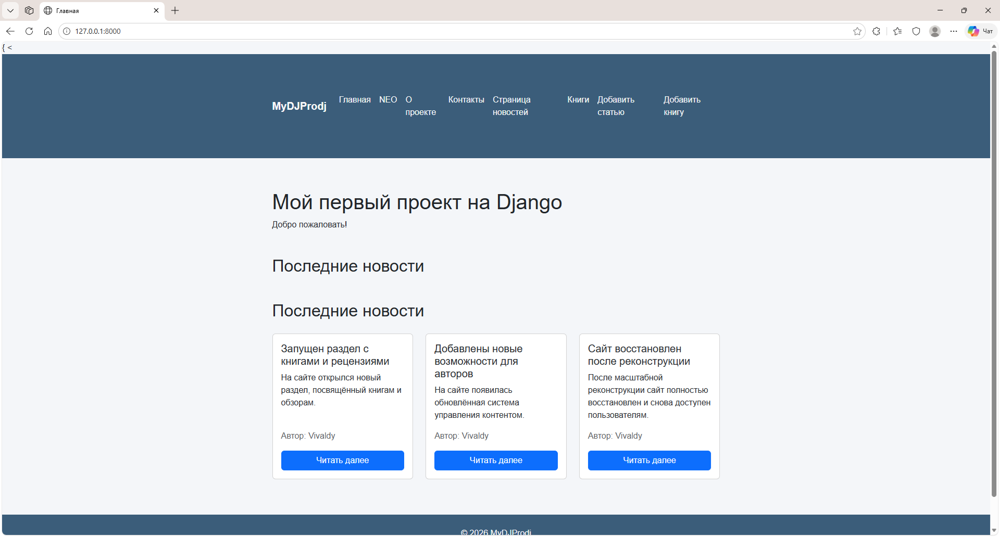
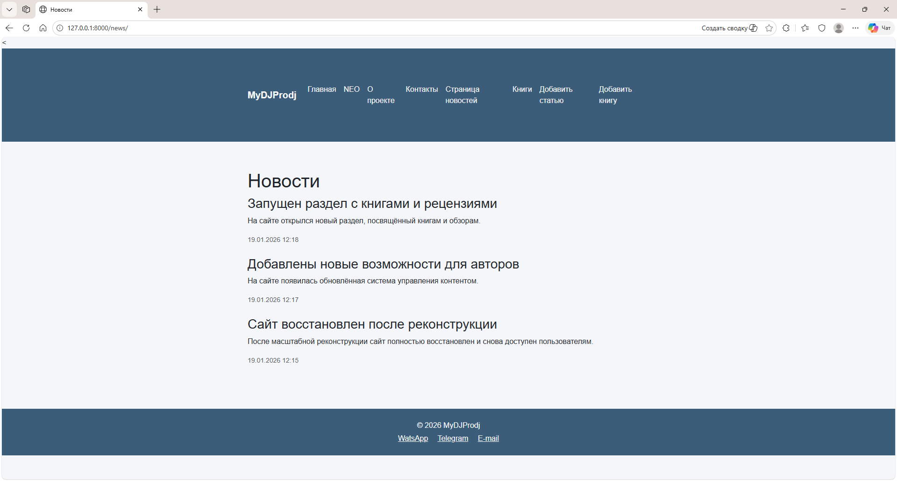
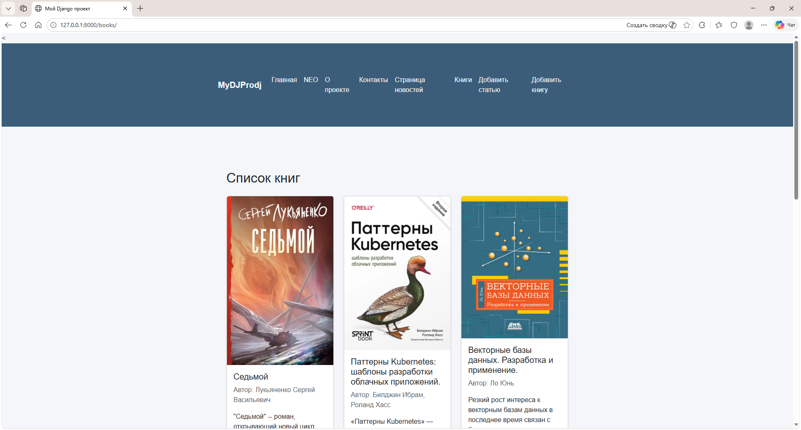
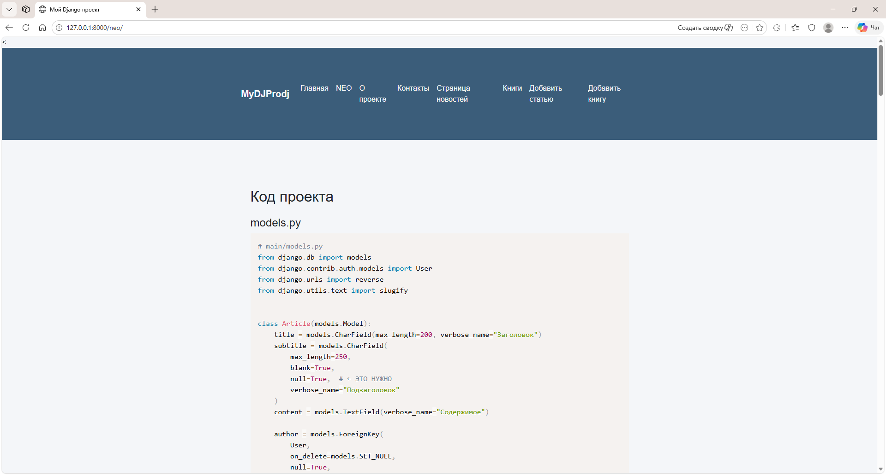

# MyDJProdj — учебный Django‑проект


Учебный проект, созданный в процессе изучения Django.  
Содержит систему новостей, страницу NEO с подсветкой кода, навигацию, шаблоны и кастомизацию админки.

---

## 📸 Скриншоты

| Home | News | Books | Neo |
|------|------|-------|-----|
|  |  |  |  |

                        

---

## 🚀 Функциональность

### Основные страницы
- `/` — главная
- `/neo/` — страница с подсветкой кода (Prism.js + тёмная тема)
- `/about/` — о проекте
- `/contacts/` — контакты

### Новости
- `/news/` — список новостей
- `/news/<id>/` — детальная страница
- Bootstrap‑карточки
- «Читать далее»
- Автоматическое назначение автора

### Книги
- `/books/` — список книг
- `/books/<id>/` — детальная страница книги
- Обложки, описание, отзыв
- Карточки с кнопкой «Подробнее» 

### Админка
- Кастомизированный список новостей
- Поиск, фильтры, сортировка
- Отображение slug
- Служебные поля в collapsible‑блоках

---

## 📂 Структура проекта

```text
MyDJProdj/
│
├── main/
│   ├── migrations/
│   ├── static/
│   │   └── main/
│   │       └── style.css
│   │
│   ├── templates/
│   │   ├── base.html
│   │   └── main/
│   │       ├── about.html
│   │       ├── add_book.html
│   │       ├── article_delete_confirm.html
│   │       ├── article_form.html
│   │       ├── article_list.html
│   │       ├── article_preview.html
│   │       ├── articles.html
│   │       ├── book_detail.html
│   │       ├── book_list.html
│   │       ├── contacts.html
│   │       ├── index.html
│   │       └── neo.html
│   │
│   ├── blocks/
│   │   ├── detail.html
│   │   ├── footer.html
│   │   ├── header.html
│   │   └── list.html
│   │
│   ├── admin.py
│   ├── apps.py
│   ├── models.py
│   ├── urls.py
│   └── views.py
│
├── news/
│   ├── migrations/
│   ├── admin/
│   │   └── news/
│   │       └── change_list.html
│   │
│   ├── templates/
│   │   └── news/
│   │       ├── detail.html
│   │       ├── home.html
│   │       └── news.html
│   │
│   ├── admin.py
│   ├── apps.py
│   ├── models.py
│   ├── urls.py
│   └── views.py
│
├── media/
│   └── books/
│
├── screenshots/
│   ├── homedj.png
│   ├── news.png
│   ├── books.png
│   └── neo.png
│
├── .env
├── env.example
├── requirements.txt
├── run_django.bat
├── stop_django.bat
├── manage.py
└── venv/

```
---

## ▶️ Запуск проекта

### 1. Через скрипт

Если используете встроенный скрипт:

```
run_django.bat

```


Скрипт автоматически:

- переходит в папку проекта  
- активирует виртуальное окружение  
- запускает сервер  

### 2. Запуск вручную

```
cd MyDJProdj
venv\Scripts\activate
python manage.py runserver
```

---

## ⏹ Остановка сервера

Используйте удобный скрипт:

```
stop_django.bat

```

Скрипт:

- находит процессы Django
- завершает их
- выводит статус
- работает в кодировке UTF‑8

---
---

## 🛠 Используемые технологии

- Python 3.x  
- Django 5.2
- Bootstrap 5
- Prism.js (подсветка кода)                                
- HTML + CSS 

---

## 📌 Планы по развитию

- Пагинация новостей
- Категории
- Изображения к новостям
- Категории новостей
- Форма обратной связи
- Улучшение дизайна админки

---

## 📄 Лицензия

Проект создан в учебных целях.

```